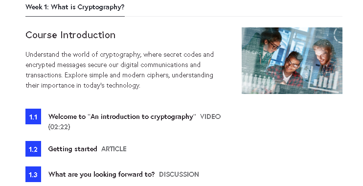
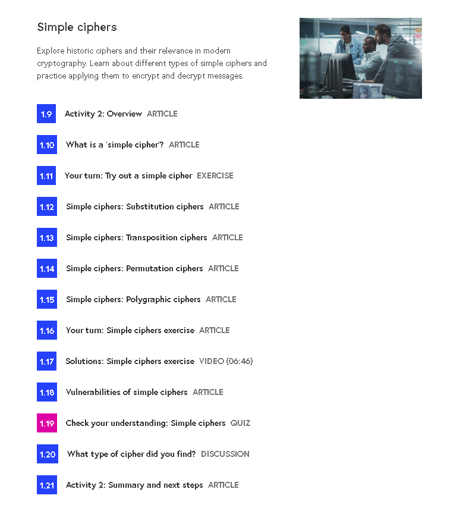
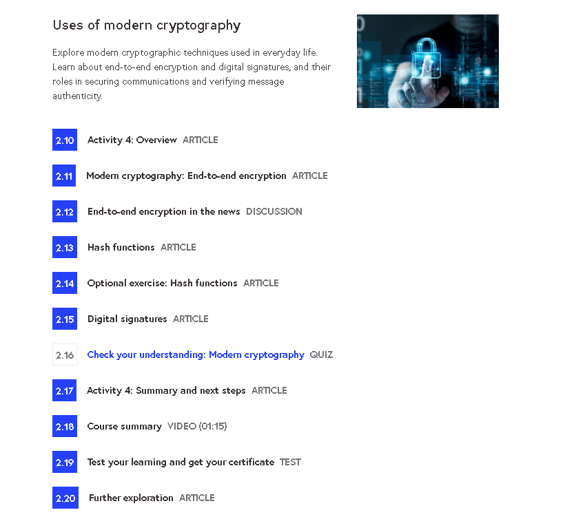
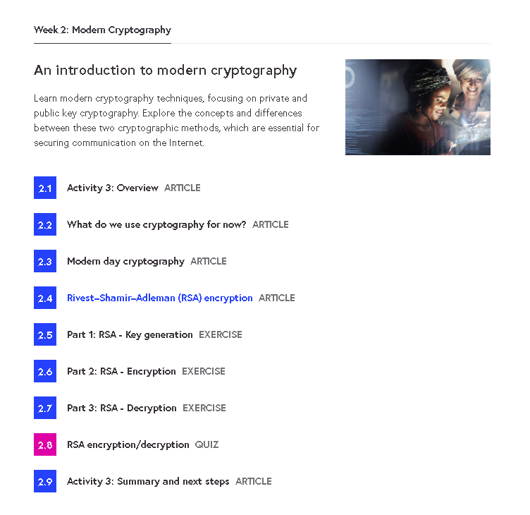

# 🔐 An Introduction to Cryptography – FutureLearn

This repository documents what I learned from the **An Introduction to Cryptography** course by the **University of Leeds**, in collaboration with **Click Start** and the **Institute of Coding**, hosted on **FutureLearn**.

---

## 📜 Certificate

- 🧠 [An Introduction to Cryptography – FutureLearn Certificate](./cert/an-intro-to-cryptography-futurelearn.pdf)

---

## 📒 Topics Covered

- 🔑 Symmetric vs Asymmetric Encryption  
- 🛡️ Hashing and Data Integrity  
- 🌐 Real-World Applications of Cryptography  
- 🕰️ Historical Ciphers & Cryptanalysis Foundations

---

## 📂 Repository Structure

| Folder        | Content                                              |
|---------------|------------------------------------------------------|
| `notes/`      | Topic-wise summaries and concepts                   |
| `demo/`       | Python demo scripts for crypto concepts             |
| `cert/`       | Certificate of Achievement from FutureLearn         |
| `screenshots/`| Visuals from the course (Week 1 & 2)                |

---

## 📚 Notes

- [`symmetric-vs-asymmetric.md`](./notes/symmetric-vs-asymmetric.md)  
- [`hashing-and-integrity.md`](./notes/hashing-and-integrity.md)  
- [`real-world-applications.md`](./notes/real-world-applications.md)  
- [`historical-ciphers.md`](./notes/historical-ciphers.md)

---

## 📸 Course Screenshots

| Week / Topic                | Screenshot |
|-----------------------------|------------|
| 🧭 Week 1 – Introduction     |  |
| 🔐 Week 1 – Cipher Examples  |  |
| 🧠 Week 2 – Cryptographic Use Cases |  |
| 💡 Week 2 – Summary          |  |

---

## 💻 Demo Scripts

| Script                       | Description                                      |
|-----------------------------|--------------------------------------------------|
| [`rsa_keygen_demo.py`](./demo/rsa_keygen_demo.py)   | RSA key generation, encryption, and decryption |
| [`sha256_hash_demo.py`](./demo/sha256_hash_demo.py) | Hash comparison using SHA-256                   |

> Run these scripts with Python 3. Requires `cryptography` library (`pip install cryptography`).

---

## 📝 Course Review

This course provides a strong conceptual foundation in cryptography for beginners. The pacing is clear, and topics are introduced with practical analogies and historical context.

### ✅ What I Liked:
- Beginner-friendly explanation of complex topics  
- Focus on both theory and application  
- Delivered by credible academic institutions  
- No prior deep math or coding required

### 🔧 What Could Be Improved:
- Could include more real-world crypto attacks  
- Lacks hands-on labs or challenges

---

## 🎓 Final Thoughts

I recommend this course to:

- 🧑‍💻 Security beginners  
- 🔐 Anyone transitioning into cybersecurity  
- 🎓 Computer science students curious about cryptography

---

## ✍️ Author

**Thành Danh** – Pentester & Cybersecurity Research  

GitHub: [@ngvtdanhh](https://github.com/ngvtdanhh)  

Email: ngvu.thdanh@gmail.com

---

## 📄 License

This project is licensed under the terms of the **GNU AGPL v3.0**.  
See [`LICENSE`](./LICENSE) for full details.

© 2025 ngvtdanhh. All rights reserved.
